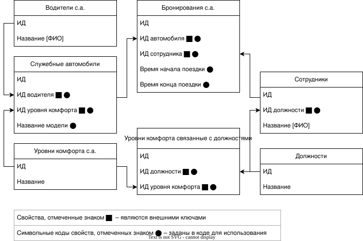

# Содержимое выполненного тестового задания

Файлы тестового задания:
* [test_task_info/TEST_TASK_INFO.md](./TEST_TASK_INFO.md) – Описание выполнения
* [test_task_info/IB_STRUCTURE.drawio.svg](./IB_STRUCTURE.drawio.svg) – Схема инфоблоков и их связей
* [site/local/components/test_task_components/test_task/class.php](../site/local/components/test_task_components/test_task/class.php)
– Компонент с логикой получения согласно заданию
* [site/test_task/index.php](../site/test_task/index.php)
– Пример использования компонента с логикой получения согласно заданию

# Описание выполнения тестового задания

По заданию выполнено:

1. Структура инфоблоков, удовлетворяющая условиям задачи,
   представлена в файле
   [test_task_info/IB_STRUCTURE.drawio.svg](./IB_STRUCTURE.drawio.svg)
2. Тестовый компонент, позволяющий просмотреть доступные для
   использования в служебной поездке, то есть не забронированные
   другими сотрудниками.  
   Для определения машин учитываются:

* Дата с временем начала поездки и дата с временем конца поездки.
  Эти параметры компонент получает из `$_GET` параметров, при
  отсутствии или неверном формате параметров выводится сообщение и
  выполнение получения списка машин прекращается. Требует инфоблоки:
    * "Бронирования служебного автомобиля"
* ИД сотрудника - задается из параметров компонента. ИД сотрудника
  обязательно от существующего элемента инфоблока "Сотрудники"
* Уровень комфорта для должности текущего сотрудника - отображаются
  только автомобили из тех уровней комфорта, что связаны с должностью
  текущего сотрудника. Требует инфоблоки:
    * "Должности"
    * "Уровни комфорта связанные с должностями"
    * "Уровни комфорта служебных автомобилей"
    * "Служебные автомобили"
* Название модели служебного автомобиля, ФИО водителя,
  название уровня комфорта - для каждого подходящего для бронирования
  автомобиля отображаются дополнительные данные.
  Требует инфоблоки:
    * "Водители служебного автомобиля"
    * "Уровни комфорта служебных автомобилей"
    * "Служебные автомобили"

<figure>
    
    <figcaption>Структура инфоблоков тестового задания (Схема создана в diagrams.net - бывшем draw.io)</figcaption>
</figure>

<table>
<caption>
    Таблица с указанием соответствия символьных кодов и названий ИБ и свойств 
</caption>
  <tr>
    <th>Название ИБ/свойства</th>
    <th>Символьный код</th>
  </tr>
<!-- iblocks -->
  <tr>
    <td>ИБ Служебные автомобили</td>
    <td><code>company_car</code></td>
  </tr>
  <tr>
    <td>ИБ Уровни комфорта служебных автомобилей</td>
    <td><code>company_car_comfort_type</code></td>
  </tr>
  <tr>
    <td>ИБ Водители служебных автомобилей</td>
    <td><code>company_car_driver</code></td>
  </tr>
  <tr>
    <td>ИБ Бронирования служебных автомобилей</td>
    <td><code>company_car_booking</code></td>
  </tr>
  <tr>
    <td>ИБ Сотрудники</td>
    <td><code>employee</code></td>
  </tr>
  <tr>
    <td>ИБ Должности</td>
    <td><code>job</code></td>
  </tr>
  <tr>
    <td>ИБ Уровни комфорта связанные с должностями</td>
    <td><code>job_and_comfort_type</code></td>
  </tr>
<!-- properties -->
  <tr>
    <td>ИД водителя (внешн.)</td>
    <td><code>driver_id_ext</code></td>
  </tr>
  <tr>
    <td>ИД должности (внешн.)</td>
    <td><code>job_id_ext</code></td>
  </tr>
  <tr>
    <td>ИД служебного автомобиля (внешн.)</td>
    <td><code>company_car_id_ext</code></td>
  </tr>
  <tr>
    <td>Название модели</td>
    <td><code>model_name</code></td>
  </tr>
  <tr>
    <td>ИД уровня комфорта (внешн.)</td>
    <td><code>company_car_comfort_type_id_ext</code></td>
  </tr>
  <tr>
    <td>Время начала поездки</td>
    <td><code>company_car_booking_busy_from</code></td>
  </tr>
  <tr>
    <td>Время окончания поезки</td>
    <td><code>company_car_booking_busy_to</code></td>
  </tr>
  <tr>
    <td>ИД сотрудника (внешн.)</td>
    <td><code>employee_id_ext</code></td>
  </tr>
</table>
